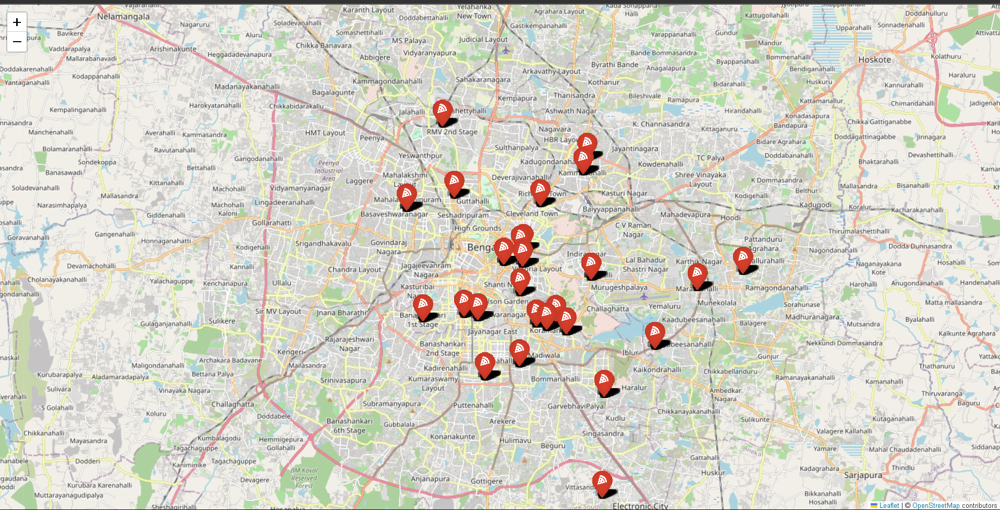

# 🍽️ Zomato Bangalore Restaurant Analysis & Geospatial Visualization

This project explores the restaurant landscape of Bangalore using Zomato's dataset. It combines data cleaning, exploratory data analysis (EDA), and interactive geospatial visualization using Folium to understand restaurant density and cuisine distribution across the city.

---

## 📁 Dataset

- **Zomato Data**: Contains restaurant details including name, rating, cuisine, cost, type, and location.
- **Geographical Coordinates**: Contains latitude and longitude for Bangalore localities to enable location-based mapping.

---

## 📌 Project Highlights

### ✅ Data Cleaning & Preprocessing
- Converted ratings to float and filled missing values using median.
- Cleaned cost data by removing commas and handling missing values.
- Filled missing categorical values (`cuisines`, `dish_liked`, `rest_type`) with appropriate defaults.
- Encoded binary fields like `online_order` and `book_table`.
- Merged Zomato data with geographical coordinates using `listed_in(city)`.

### 📊 Exploratory Data Analysis (EDA)
- Distribution of restaurant ratings
- Top cuisines offered across Bangalore
- Top localities by restaurant count
- Cost vs rating scatter analysis
- Restaurant type frequency

### 🌍 Geospatial Visualization with Folium
- **Restaurant Density Map**: Shows overall restaurant concentration across Bangalore.
- **Cuisine-Specific Map**: Highlights restaurants that serve **Italian cuisine** using customized markers.
- All maps are interactive and saved as `.html` for easy sharing and exploration.

---

## 📷 Screenshots

### 🔸 Rating Distribution
.png)

### 🔸 Top Cuisines
.png)

### 🔸 Italian Restaurants Map

---

## 🚀 How to Run

1. Clone the repository:

```bash
git clone https://github.com/jafar90147677/Zomato-Bangalore-Restaurant-Analysis.git
cd Zomato-Bangalore-Restaurant-Analysis
